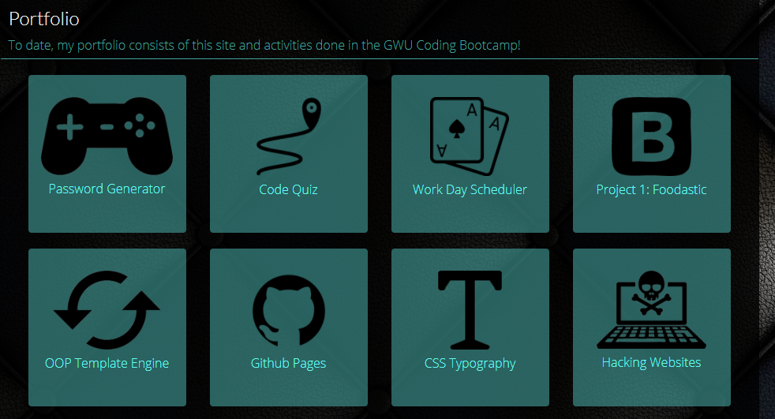

#### hw2ResponsivePortfolio, 17 NOV 20, 4 FEB 21

#### By Ashley Stith

## Description
This site is built using the Bootstrap framework to ensure responsiveness on a variety of devices and windows.  It includes 3 html pages, a custom CSS file, as well as, external links to the Bootstrap CSS.

## Portfolio Page
Repo has been updated for the Career assignment: Update Portfolio Page. Screenshot of Portfolio page with live links to activities and Project 1 included below:

## Setup/Installation Requirements
* Open site using Google Chrome
* Use Dev Tools "Responsive" mode to test how the pages look on different screen sizes

## Known Bugs
There are no known bugs. All pages have been passed through the W3C HTML validation service.

## Technologies Used
HTML
CSS
Bootstrap framework

## Contribution Guidlines
Direct link to repository: https://github.com/stithac/hw2ResponsivePortfolio

